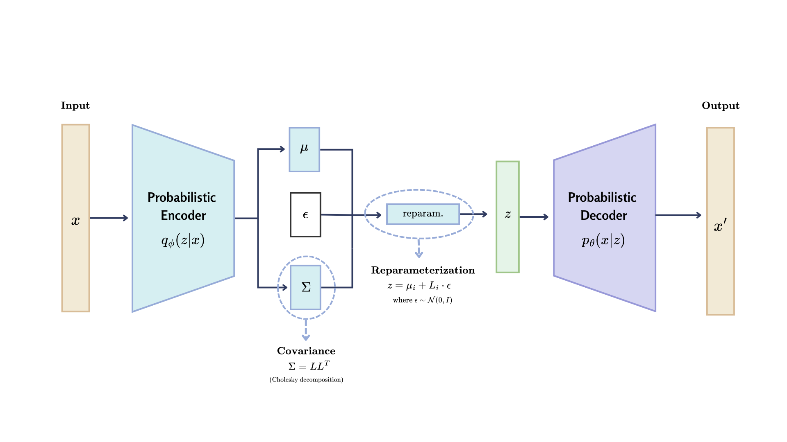

# LVAE: Learned-Correlation Variational Autoencoder for Single-Cell RNA-seq Data Simulation

## Overview

LVAE (Learned-Correlation Variational Autoencoder) is a prototype implementation for simulating single-cell RNA-seq data. It is designed to preserve cell-type–specific structure by learning the full latent covariance matrix via a Cholesky factorization.



This project has been refactored into a modular and configurable architecture to facilitate experimentation, reproducibility, and maintainability.

## How It Works

1.  **Preprocessing**: The pipeline starts by preprocessing raw scRNA-seq data using Scanpy, including quality control, normalization, and selection of highly variable genes.
2.  **Per-Cell-Type Training**: A separate LVAE model is trained for each cell type. This allows the model to learn the specific nuances of each cell population.
3.  **Latent Representation**: Each model learns a per-cell latent representation consisting of:
    - `μ`: The latent mean vector.
    - `L`: The lower-triangular Cholesky factor of the covariance matrix (`Σ = L * L^T`).
4.  **Custom Loss Function**: The training uses a custom VAE loss that combines a reconstruction error (MSE) with a KL divergence term adapted for a full covariance matrix.
5.  **Synthetic Data Generation**: After training, various latent sampling strategies are used to generate new latent vectors (`z`), which are then decoded to produce synthetic gene expression profiles.

## Key Features

- **Full Covariance Modeling**: Improves latent space expressivity over standard diagonal VAEs.
- **Centralized Configuration**: All experiment parameters are managed through YAML files.
- **Per-Cell-Type Training**: Preserves intra-type heterogeneity.
- **Flexible Latent Sampling**: Supports multiple strategies for generating synthetic data.
- **AnnData Integration**: Uses `AnnData` for data manipulation and saves outputs as `.h5ad` files.

## Latent Sampling Strategies

The model supports four different strategies to generate synthetic data from the learned latent space:

1.  **Direct Sampling**: Generates one synthetic cell from each real cell's learned Gaussian distribution `N(μ, LL^T)`.
2.  **Per-Cell Sampling**: Generates `k` synthetic samples from each cell's distribution to increase diversity.
3.  **Global-Mean Sampling**: Samples from a single Gaussian representing the population's average distribution.
4.  **GMM Sampling**: Fits a Gaussian Mixture Model where each cell's learned distribution is a component, then samples from this mixture.

## Project Structure

The codebase is organized into four main modules within the `src/` directory:

### `src/model/`

Contains the core model implementation and training scripts.

- **`LVAE_model.ipynb`**: Implementation of the LVAE architecture, training loops, and loss function definitions. This is the entry point for training the model on your own datasets.

### `src/benchmarks/`

Scripts dedicated to validating the quality and fidelity of the generated data.

- **`celltypist_validation.ipynb`**: Supervised validation pipeline that trains a CellTypist classifier on real data and applies it to synthetic data. Measures how well the generative model preserves cell-type identity by checking if the classifier can accurately recover labels in the synthetic dataset.
- **`fidelity_stats.ipynb`**: Statistical comparison between real and synthetic data (e.g., LVAE, scRDiT, scDesign2). Computes metrics like Mann-Whitney U tests, AUC, and visualizes gene expression distributions using boxplots and heatmaps.
- **`integration_metrics.ipynb`**: Evaluates how well synthetic data integrates with real data using batch-correction methods (Harmony, Scanorama, BBKNN, ComBat). Computes integration scores like **iLISI** (integration quality) and **Silhouette** (cluster preservation).

### `src/analysis/`

Downstream biological analysis to verify if the synthetic data preserves biological signals.

- **`gene_correlation.ipynb`**: Analysis of gene-gene co-expression patterns (e.g., Pearson correlation heatmaps) to ensure regulatory networks are maintained.
- **`label_transfer_knn.ipynb`**: Uses k-Nearest Neighbors (k-NN) to transfer labels from real to synthetic data, assessing if cell types are distinct and recognizable in the synthetic latent space.
- **`trajectory_pseudotime.ipynb`**: Infers biological trajectories (e.g., differentiation paths) using Diffusion Maps and Pseudotime (DPT) to check if the model captures continuous developmental processes (e.g., Mus musculus).

### `src/visualization/`

Visualization tools for qualitative assessment.

- **`global_umap.ipynb`**: Generates global UMAP embeddings to visualize the overlap and structure of real vs. synthetic datasets.
- **`marker_dotplots.ipynb`**: Creates dot plots to compare the expression of key marker genes across cell types between real and synthetic data.

## Installation

1.  Clone the repository:

    ```bash
    git clone https://github.com/ufvceiec/LVAE.git
    cd LVAE
    ```

2.  Install the required dependencies:
    ```bash
    pip install -r requirements.txt
    ```

## Contributing & Contact

For feedback, bug reports, or feature requests, please open an issue in the repository. Pull requests are welcome.
